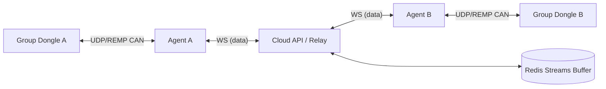

# New Dashboard Specification — OBD2 Déporté (post‑POC)

**Version:** v0.7 (supersedes v0.6)  
**Status:** Draft (implementation-ready)  
**Scope:** Replace/extend the validated `web-interface` POC with a production dashboard.  
**Primary deployment target:** **Ubuntu** (VPS for Cloud Dashboard, desktop OS for Bridge Agent).  
**Mandatory runtime component:** **Bridge Agent (tray app)** is required to use dongles.  

> **Decision:** “Pairing Hub” is **NOT** a distinct service. It is a **module inside the single Cloud API** (same deployment, same DB).

---

## 0. Changelog

### v0.7 (this document)
- Fix version mismatch (v0.4 → v0.7).
- Lock backend choice: **Express**.
- Add **system diagrams** (control plane + data plane).
- Add **Data-plane routing & buffering** section for 2‑dongle groups (VPS relay now; multi-region later).
- Make **Discovery** protocol implementable: versioning, framing, length, CRC, interface selection rules.
- Specify **pairing mode TTL**, PIN attempt limits, cooldown, and **SECURITY_HOLD triggers**.
- Add **API versioning** (`/api/v1`) + request/response schemas + standardized error format.
- Add **Streaming (SSE) contract**: event types, schema, reconnection, backpressure.
- Add **Key management** section (AES‑GCM key rotation + envelope format).
- Expand **DB schema** with missing tables (`sessions`, `email_verification_tokens`, `password_reset_tokens`, optional `email_outbox`) + constraints/indexes.
- Add **Security review**: threat model controls (CSRF, rate limits, audit coverage, agent trust).
- Expand **CI/CD & ops**: Prisma migrations + rollback, secrets, backups, observability.

---

## 1. Context (validated POC baseline)

The current POC validated the following technical foundations:

- Secure **HTTPS pairing** with PIN and token issuance.
- **UDP transport using REMP v1** between dongle and local backend.
- **CAN RX/TX and CAN configuration** over the network.
- Working UI basics: discovery, pairing, basic console, basic command sending.

This spec turns the POC into a **production dashboard** with clear operational semantics and edge-case handling.

---

## 2. Goals

1. Provide a **secure, production-grade dashboard** for:
   - pairing/unpairing
   - dongle ownership and inventory
   - dongle grouping (2 dongles per group, deterministic)
   - CAN configuration
   - live console + command console
2. Make the system **deterministic and debuggable** in real deployments:
   - explicit protocols
   - explicit state machines
   - explicit buffering/backpressure rules
3. Support professional workflows:
   - audit logs
   - admin force actions
   - clear UX for offline / degraded situations
4. Be deployable on a single VPS for v1 with clean forward path to multi-region routing later.

---

## 3. Non-goals (v1)

- No multi-tenant organizations/workspaces beyond user roles (v1).
- No browser-to-dongle direct connectivity (intentionally avoided).
- No full “diagnostic tool emulator” in the web UI (console only).
- No native mobile apps (v1).

---

## 4. Terminology

- **Cloud Dashboard / Cloud API**: the VPS-hosted web app and its API (single service deployment).
- **Bridge Agent**: mandatory desktop tray app running on the same LAN as dongles.
- **Dongle**: embedded device on a LAN, speaking UDP (REMP) to the agent.
- **Discovery**: LAN broadcast mechanism used by agent to list dongles available on the LAN.
- **Pairing**: linking a dongle to a user account, issuing a token stored by the agent.
- **Dongle Token**: secret used by agent to authenticate to dongle; stored encrypted at rest in DB.
- **Device ID**: stable 8-byte hardware identifier reported by firmware (`dev_id`), represented as a 16-character hex string in APIs and storage.
- **Dongle Group**: exactly **two** dongles linked together to form a remote diagnostic bridge.
- **Control plane**: inventory/pairing/config/commands.
- **Data plane**: CAN frame relaying between the two dongles of a group.

---

## 5. Architecture

### 5.1 Control plane vs data plane

- **Control plane** is cloud-driven (UI ↔ API ↔ Agent ↔ Dongle).
- **Data plane** (CAN frame routing) is **relayed on the VPS** in v1.

### 5.2 System diagrams

#### Control plane (v1)

```mermaid
flowchart LR
  UI[Web UI] <-- HTTPS --> API[Cloud API (Express)]
  API <-- WS (control) --> AG[Bridge Agent (tray)]
  AG <-- UDP (REMP) --> D1[Dongle]
  AG <-- UDP (REMP) --> D2[Dongle]
  API <---> DB[(PostgreSQL)]
```

#### Data plane (v1: VPS relay)



> **Decision:** In v1, CAN frames are routed on the **same VPS** hosting the Cloud API (cloud is the relay).  
> **Future:** frames may be routed by different relay servers depending on dongle locations.

---

## 6. Monorepo structure

```
repo/
  apps/
    dashboard-web/        # Vite + TS frontend
    dashboard-api/        # Express API (single service incl. pairing module)
    bridge-agent/         # Desktop tray agent (Node/TS)
  packages/
    shared/               # Shared types, schemas, protocol constants
    remp/                 # REMP v1 helpers (encode/decode)
  infra/
    nginx/
    systemd/
    scripts/
  prisma/
    schema.prisma
    migrations/
```

---

## 7. Tech stack

- **Frontend:** Vite + TypeScript
- **Backend:** Node.js + **Express** (decision)
- **DB:** PostgreSQL
- **Realtime control plane:** WebSocket (API ↔ Agent)
- **Streaming to UI:** Server-Sent Events (SSE)
- **Data plane buffering:** **Redis Streams** (required for v1 “buffer, don’t drop”)
- **ORM/Migrations:** Prisma
- **Reverse proxy:** Nginx
- **Process manager:** systemd

---

## 8. Authentication & authorization

### 8.1 Auth model
- Email + password
- Password hashing: **Argon2id**
- Auth session: **server-side sessions** with secure HttpOnly cookies
  - Cookie flags: `HttpOnly`, `Secure`, `SameSite=Lax` (default)
- Roles:
  - `user`
  - `super_admin`

### 8.2 CSRF (required)
Because we use cookies:
- For unsafe methods (`POST/PUT/PATCH/DELETE`), require CSRF protection:
  - `SameSite=Lax` helps, but we still require a CSRF token.
- Approach:
  - API exposes `GET /api/v1/auth/csrf` returning a token.
  - Frontend sends header `X-CSRF-Token: <token>` for unsafe calls.
  - Token is bound to the session.

### 8.3 Rate limits (required)
Apply server-side rate limiting:
- `/auth/login`: e.g., 10 attempts / 10 min / IP + per account
- `/auth/signup`: e.g., 5 / hour / IP
- password reset requests: e.g., 3 / hour / account + IP

### 8.4 Admin powers
Super-admins can:
- Force-unpair dongles
- Disable users
- View audit logs

All admin actions MUST generate audit log entries.

---

## 9. Bridge Agent (mandatory)

### 9.1 Responsibilities
- Discover dongles on LAN (UDP broadcast).
- Maintain a control connection to Cloud API (WebSocket):
  - report discovered dongles
  - receive commands/config updates
  - forward console and CAN frames
- Speak UDP REMP to dongles:
  - pairing-mode commands
  - CAN config apply
  - command console `CMD_REQ/CMD_RSP`
  - CAN frames for group bridging

### 9.2 Agent identity & registration
- Agent installs per user and is registered once:
  - `POST /api/v1/agents/register` returns `agent_token`.
- Agent uses `agent_token` to authenticate its WebSocket connection.
- Agent must include:
  - `agent_id` (UUID)
  - `hostname`
  - `os`
  - `version`
  - `network_interfaces` summary (sanitized)

### 9.3 Multi-NIC behavior (required)
The agent MUST broadcast discovery per eligible interface:
- Enumerate interfaces; keep only those that are:
  - `UP`
  - not loopback
  - have IPv4 address + broadcast address
- Explicitly exclude typical virtual/VPN interfaces:
  - names matching: `tun*`, `tap*`, `wg*`, `utun*`, `ppp*`, `docker*`, `br-*`, `vbox*`, `vmnet*`
- If multiple eligible interfaces exist:
  - broadcast DISCOVER on each interface’s broadcast address
  - keep per-interface discovery results and merge by `device_id`
- The UI must show dongle’s `lan_ip` as reported by that interface.

---

## 10. Discovery (DECISION)

### 10.1 Method: UDP broadcast
- Agent sends `DISCOVER` packets on LAN.
- Dongle replies unicast with `ANNOUNCE`.

### 10.2 Packet format + versioning (required)

**Decision:** Binary framed packets with explicit length + CRC32.

#### 10.2.1 Common header (DISCOVER and ANNOUNCE)
All fields are little-endian unless stated.

| Field | Size | Description |
|---|---:|---|
| `magic` | 4 | ASCII `"OBD2"` |
| `proto` | 1 | `0x01` (Discovery protocol v1) |
| `msg_type` | 1 | `0x01 = DISCOVER`, `0x02 = ANNOUNCE` |
| `flags` | 1 | reserved (0 in v1) |
| `header_len` | 1 | bytes (18 for v1, 16 for legacy) |
| `payload_len` | 2 | payload size in bytes |
| `seq` | 4 | sequence id (agent increments) |
| `crc32` | 4 | CRC32 of header (with crc32=0) + payload |

CRC polynomial: standard Ethernet CRC32 (0x04C11DB7).

#### 10.2.2 DISCOVER payload (v1)
DISCOVER payload is empty (`payload_len = 0`) in v1.

#### 10.2.3 ANNOUNCE payload (v1)
ANNOUNCE payload uses TLV entries (Type-Length-Value):

| TLV Type | Name | Value |
|---:|---|---|
| 0x01 | `device_id` | 8-byte device id (`dev_id`) |
| 0x02 | `fw_build` | UTF‑8 string |
| 0x03 | `udp_port` | uint16 |
| 0x04 | `capabilities` | bitmask uint32 |
| 0x05 | `proto_ver` | uint16 (REMP version supported) |
| 0x06 | `lan_ip` | IPv4 (4 bytes) |
| 0x07 | `pairing_state` | uint8 (`0=normal`, `1=pairing_mode`) |
| 0x08 | `pairing_nonce` | 16 bytes (present only in pairing_mode) |

Unknown TLVs must be ignored (forward compatible).

### 10.3 Scan rates
- Pairing page open: every 2–5s
- Background: every 15–30s

### 10.4 Robustness rules
- Packets with invalid CRC are ignored.
- Packets with unknown `proto` are ignored.
- `seq` is echoed by dongle in ANNOUNCE (as received) when possible (optional in v1 firmware).

### 10.5 Discovery diagnostics
- Set `BRIDGE_AGENT_DEBUG_DISCOVERY=1` to log interfaces, bind port, decode failures, and discovery reports.
- Agent binds to the configured discovery port when possible and falls back to an ephemeral port if the bind fails.

---

## 11. Pairing & ownership model

### 11.1 Ownership states
- `UNCLAIMED`
- `CLAIMED_ACTIVE`
- `RESET_DETECTED`
- `SECURITY_HOLD`

Cloud database is the **source of truth** for ownership.

### 11.2 Pairing mode TTL & PIN limits (required)
- Pairing mode TTL: **120 seconds**
- Wrong PIN max attempts: **5 attempts**
- After 5 wrong attempts:
  - enter **cool-down** for **5 minutes**
  - set state to `SECURITY_HOLD`

### 11.3 SECURITY_HOLD semantics (required)
A dongle enters `SECURITY_HOLD` when any trigger is met:

1. **Too many wrong PIN attempts** (≥ 5) within a pairing window.
2. **Reset detection** while claimed:
   - dongle reports factory reset OR device secret changes OR token no longer matches.
3. **Suspicious agent behavior**:
   - repeated pairing-mode toggles (e.g., > 10 starts/hour) for same dongle
   - agent_id mismatch patterns (token used from many distinct agents unexpectedly)
4. **Auth anomaly**:
   - repeated token-auth failures above threshold (e.g., > 20/min) from same LAN IP.

Behavior:
- Pairing is blocked while in `SECURITY_HOLD`.
- UI shows “Security hold — contact support”.
- Only super-admin can clear hold (force-unpair / manual reset flow).

### 11.4 Pairing flow (v1)
1. Agent discovers dongle (ANNOUNCE shows it available).
2. User clicks “Enter pairing mode”.
3. Cloud API instructs agent to send `PAIRING_MODE_START` to dongle (REMP).
4. Dongle:
   - enters pairing mode for 120s
   - generates:
     - `pin` (6 digits, displayed physically if possible)
     - `pairing_nonce` (16 bytes, included in ANNOUNCE TLV while in pairing mode)
5. User enters PIN in dashboard.
6. Agent sends `PAIRING_SUBMIT` to dongle with `{pin, pairing_nonce, dongle_token}`.
7. On success, dongle returns `PAIRING_OK` including a `token_fingerprint` (and optionally `device_proof` later).
8. Cloud API issues a **dongle_token**, stores it encrypted, sends it to the agent for `PAIRING_SUBMIT`, and links dongle to the user.

### 11.5 Edge cases
- Already owned by same user → idempotent (safe no-op)
- Owned by another user → blocked, super-admin/support only
- Factory reset → `RESET_DETECTED` until resolved
- Race condition → first PIN success wins
- No agent → pairing blocked

---

## 12. Unpairing

- User can unpair a dongle they own.
- Super-admin can force-unpair any dongle.
- Unpairing clears:
  - ownership link
  - stored encrypted dongle token
  - group membership (if any)
- All unpair events must be audited.

---

## 13. Dongle groups (DECISION)

### 13.1 Group constraints
- A group contains **exactly two dongles**:
  - `dongle_a_id`
  - `dongle_b_id`
- Both dongles must be owned by the same user (v1).
- A dongle can belong to at most one group.

### 13.2 Group modes
- `INACTIVE` (no bridging)
- `ACTIVE` (bridging enabled)
- `DEGRADED` (one side offline, buffering active)

### 13.3 Data-plane routing & buffering (DEDICATED SECTION)

#### 13.3.1 v1 routing decision
- CAN frames for an ACTIVE group are routed on the **VPS**.
- The Cloud API acts as the **relay** for v1.

#### 13.3.2 Future routing (non-v1)
- In later versions, routing may be delegated to region-specific relays based on dongle locations.
- The Cloud API becomes the control plane for selecting relays, while relays handle data plane.

#### 13.3.3 Online/offline behavior (required)
If one side is offline:
1. UI must clearly show which side is offline (presence).
2. The relay must **buffer frames** instead of dropping them.
3. The group enters `DEGRADED`.

#### 13.3.4 Buffering implementation (v1 decision)
To satisfy “buffer, don’t drop” with reliability:
- Use **Redis Streams** as the buffering layer.
- One stream per group-direction:
  - `group:{group_id}:a_to_b`
  - `group:{group_id}:b_to_a`

Retention:
- Default retention: **10 minutes** OR **max 200,000 frames**, whichever comes first.
- If retention limit is reached:
  - system enters `BUFFER_PRESSURE` state
  - UI shows warning
  - relay prioritizes keeping newest frames (trim oldest) **only as last resort**
  - all trims are audit-logged as operational events

> Note: Absolute “never drop” is physically impossible under infinite offline time or finite storage.
> The v1 contract is: **buffer within defined retention**, warn early, and keep deterministic behavior.

#### 13.3.5 Replay behavior
When the offline side reconnects:
- Relay replays buffered frames in-order from Redis Streams until caught up.
- Replay is rate-limited to avoid starving live traffic:
  - e.g., replay up to 5,000 frames/sec max (tunable)
- UI shows backlog count and catch-up progress.

#### 13.3.6 Flow control / backpressure
- Relay monitors queue depth and agent send latency.
- If queue depth exceeds threshold:
  - relay can instruct the producing agent to reduce send rate (future)
  - in v1, relay at least:
    - logs pressure
    - increases sampling of console stream (but not data-plane frames)
    - warns UI

#### 13.3.7 Data plane message ordering
- Preserve ordering per direction (A→B order preserved, B→A order preserved).
- No global ordering guarantee across both directions.

---

## 14. Configuration

### 14.1 CAN configuration model (v1)
Each dongle has a CAN configuration:
- `bitrate` (e.g., 500000, 1000000)
- `sample_point_permille` (e.g., 875 = 87.5%)
- `mode` (`normal`, `listen_only`, `loopback`, `ext_loop`)
- `use_raw` (bool, when true use raw timing fields)
- `prescaler` (raw timing)
- `sjw` (raw timing)
- `tseg1` (raw timing)
- `tseg2` (raw timing)
- `auto_retx` (bool)
- `tx_pause` (bool)
- `protocol_exc` (bool)
- optional hardware filters (future)

### 14.2 Configuration apply semantics
- Apply is explicit (user action).
- Cloud API sends config to agent → dongle.
- Dongle ACK must be returned and shown in UI.
- Config changes are audited.

---

## 15. Live console

### 15.1 Views
- Per-dongle console
- Per-group console

### 15.2 Content
- CAN RX/TX frames
- Events and errors
- Filters and rate indicators
- Presence and buffering state

### 15.3 Streaming mechanism
- SSE-based streaming from Cloud API to UI.
- Agent forwards raw events to Cloud via WebSocket.
- Cloud normalizes and emits SSE events.

---

## 16. Command console (DECISION)

### 16.1 Transport: REMP CMD over UDP
Flow:
- Dashboard → Cloud API (HTTPS)
- Cloud → Agent (WebSocket)
- Agent → Dongle (REMP `CMD_REQ`)
- Dongle → Agent (`CMD_RSP`)
- Streamed back to UI (SSE)

Security:
- Token-authenticated
- Allowlisted commands only (v1)
- Per-command permission checks + audit logs

---

## 17. API (v1)

### 17.1 Versioning (required)
All endpoints are under:
- `/api/v1/...`

Backward incompatible changes require:
- `/api/v2/...` (future)
- or additive evolution in v1 (new fields only).

### 17.2 Standard error response (required)
All non-2xx responses MUST return JSON:

```json
{
  "code": "STRING_ENUM",
  "message": "Human readable summary",
  "details": { "any": "json" }
}
```

Examples of `code`:
- `AUTH_INVALID_CREDENTIALS`
- `AUTH_SESSION_EXPIRED`
- `CSRF_INVALID`
- `DONGLE_NOT_FOUND`
- `DONGLE_OWNED_BY_OTHER`
- `PAIRING_PIN_INVALID`
- `PAIRING_SECURITY_HOLD`
- `AGENT_OFFLINE`
- `VALIDATION_ERROR`
- `INTERNAL_ERROR`

### 17.3 Endpoints (minimum + v1 schemas)

#### Auth
- `POST /api/v1/auth/signup`
- `POST /api/v1/auth/login`
- `POST /api/v1/auth/logout`
- `GET  /api/v1/auth/me`
- `GET  /api/v1/auth/csrf`

**Signup request**
```json
{ "email": "user@example.com", "password": "..." }
```

**Signup response**
```json
{ "user": { "id": "uuid", "email": "user@example.com", "role": "user" } }
```

#### Agents
- `POST /api/v1/agents/register`
- `POST /api/v1/agents/heartbeat`
- `POST /api/v1/agents/devices/report`

**Register response**
```json
{
  "agent_id": "uuid",
  "agent_token": "opaque_secret",
  "ws_url": "wss://<host>/ws/agent"
}
```

#### Dongles
- `GET  /api/v1/dongles`
- `GET  /api/v1/dongles/:id`
- `POST /api/v1/dongles/:id/pairing-mode`
- `POST /api/v1/dongles/:id/pairing-submit`
- `POST /api/v1/dongles/:id/unpair`
- `PUT  /api/v1/dongles/:id/can-config`
- `POST /api/v1/dongles/:id/commands`
- `GET  /api/v1/dongles/:id/commands/:command_id`

`GET /api/v1/dongles` returns dongles owned by the user plus unclaimed dongles visible for pairing.

**Pairing-mode start (request)**
```json
{ "action": "start" }
```

**Pairing-mode start (response)**
```json
{
  "dongle_id": "uuid",
  "pairing_session_id": "uuid",
  "expires_at": "2025-12-22T15:30:00.000Z"
}
```

**Pairing submit (request)**
```json
{
  "pairing_session_id": "uuid",
  "pin": "123456",
  "pairing_nonce": "base64_16_bytes",
  "dongle_token": "base64_bytes"
}
```
The Cloud API generates `dongle_token` if the UI does not provide it; the agent must include it in the REMP `PAIRING_SUBMIT` sent to the dongle.

**Pairing submit (response)**
```json
{
  "dongle_id": "uuid",
  "paired": true,
  "owner_user_id": "uuid"
}
```

**Apply CAN config (request)**
```json
{
  "bitrate": 500000,
  "sample_point_permille": 875,
  "mode": "normal",
  "use_raw": false,
  "prescaler": 16,
  "sjw": 1,
  "tseg1": 13,
  "tseg2": 2,
  "auto_retx": true,
  "tx_pause": false,
  "protocol_exc": false
}
```

**Apply CAN config (response)**
```json
{
  "dongle_id": "uuid",
  "applied": true,
  "effective": {
    "bitrate": 500000,
    "sample_point_permille": 875,
    "mode": "normal",
    "use_raw": false,
    "prescaler": 16,
    "sjw": 1,
    "tseg1": 13,
    "tseg2": 2,
    "auto_retx": true,
    "tx_pause": false,
    "protocol_exc": false
  },
  "applied_at": "2025-12-22T15:31:10.000Z"
}
```

**Send command (request)**
```json
{
  "command": "ifconfig",
  "args": [],
  "timeout_ms": 5000
}
```

**Send command (response)**
```json
{
  "command_id": "uuid",
  "status": "queued"
}
```

**Command status (response)**
```json
{
  "command_id": "uuid",
  "status": "running",
  "started_at": "2025-12-22T15:31:20.000Z",
  "exit_code": null,
  "stdout": "",
  "stderr": ""
}
```

#### Groups
- `GET  /api/v1/groups`
- `POST /api/v1/groups`
- `GET  /api/v1/groups/:id`
- `POST /api/v1/groups/:id/activate`
- `POST /api/v1/groups/:id/deactivate`

**Create group (request)**
```json
{ "dongle_a_id": "uuid", "dongle_b_id": "uuid" }
```

**Create group (response)**
```json
{ "group_id": "uuid", "status": "inactive" }
```

#### Streaming (SSE)
- `GET /api/v1/streams/dongles/:id/console`
- `GET /api/v1/streams/groups/:id/console`

Headers:
- `Accept: text/event-stream`
- `Last-Event-ID: <id>` (optional)

#### Admin
- `POST /api/v1/admin/dongles/:id/force-unpair`
- `POST /api/v1/admin/users/:id/disable`
- `GET  /api/v1/admin/audit-logs`

---

## 18. Streaming contract (SSE)

### 18.1 Event envelope
SSE messages use:
- `id: <monotonic_id>`
- `event: <type>`
- `data: <json>`

`id` must be strictly increasing per stream.

### 18.2 Reconnect semantics
- Client reconnects automatically when connection drops.
- Client provides `Last-Event-ID`.
- Server attempts to resume from buffer:
  - if available, continue
  - if too old, send `event: stream_reset` and resume live.

### 18.3 Buffering and backpressure (decision)
To support resume:
- Maintain a per-stream **ring buffer** in memory at API:
  - size: 10,000 events OR 60 seconds (whichever first)
- For high-rate CAN consoles:
  - apply console sampling when rate exceeds threshold:
    - e.g., only emit 1 in N frames to console view
  - **Data-plane relay is NOT sampled** (only console stream is).

### 18.4 Event types (minimum)
- `presence`
- `can_frame`
- `log`
- `command_status`
- `group_state`
- `stream_reset`

#### Example: `presence`
```json
{
  "dongle_id": "uuid",
  "online": true,
  "agent_id": "uuid",
  "seen_at": "2025-12-22T15:31:00.000Z"
}
```

#### Example: `can_frame`
```json
{
  "ts": "2025-12-22T15:31:02.000Z",
  "direction": "rx",
  "bus": "can1",
  "id": "0x7E8",
  "is_extended": false,
  "dlc": 8,
  "data_hex": "02 10 03 00 00 00 00 00"
}
```

#### Example: `group_state`
```json
{
  "group_id": "uuid",
  "mode": "degraded",
  "offline_side": "B",
  "buffered_frames_a_to_b": 12034,
  "buffered_frames_b_to_a": 0
}
```

---

## 19. Protocols

### 19.1 REMP message types used by dashboard (minimum)

This spec assumes REMP exists; this section defines the minimal message shapes needed for control and diagnostics.

#### Correlation IDs
All request/response pairs must include:
- `corr_id` (UUID)

#### CMD_REQ (Agent → Dongle)
Fields:
- `corr_id` (uuid)
- `command` (string, allowlisted)
- `args` (array of strings)
- `timeout_ms` (uint32)

#### CMD_RSP (Dongle → Agent)
Fields:
- `corr_id` (uuid)
- `status` (`ok` | `error` | `timeout`)
- `exit_code` (int32, nullable)
- `stdout` (string, may be chunked)
- `stderr` (string, may be chunked)

Chunking (optional):
- if output is large, dongle may send multiple `CMD_RSP_CHUNK` messages with:
  - `corr_id`
  - `seq` (uint16)
  - `is_last` (bool)
  - `stream` (`stdout`|`stderr`)
  - `data` (bytes/base64)

### 19.2 Pairing messages (REMP)
- `PAIRING_MODE_START`
- `PAIRING_SUBMIT`
- `PAIRING_OK`
- `PAIRING_FAIL`

These must include:
- `corr_id`
- `pairing_nonce` where relevant
- `dongle_token` in `PAIRING_SUBMIT`

---

## 20. Key management (required)

### 20.1 What is encrypted at rest
- `dongle_tokens.token_ciphertext` (AES‑256‑GCM)
- (optional) `agent_token` if stored server-side (recommended: store only hashed token)

### 20.2 Key storage (v1)
- Keys are provided via environment variables on the VPS.
- Example:
  - `DONGLE_TOKEN_MASTER_KEY_V1` (base64 32 bytes)
- Environment file stored at:
  - `/etc/obd2-dashboard.env` with permissions `0600`, owned by root.

### 20.3 Envelope format (AES‑GCM)
Store per record:
- `key_version` (e.g., 1)
- `nonce` (12 bytes)
- `ciphertext` (bytes)
- `tag` (16 bytes) OR included in ciphertext depending on lib
- `aad` (associated data) includes:
  - `dongle_id`
  - `user_id`
  - `created_at`

### 20.4 Rotation
- Add new key `DONGLE_TOKEN_MASTER_KEY_V2`
- Set server default encryption key_version to 2 for new writes.
- Run background job:
  - read tokens with version 1
  - decrypt with key v1
  - re-encrypt with key v2
  - update `key_version`
- Keep v1 key until all records migrated.
- Rotation events must be logged.

---

## 21. Database schema (detailed)

### 21.1 users
Fields:
- `id` uuid pk
- `email` unique
- `password_hash`
- `role` enum (`user`, `super_admin`)
- `status` enum (`active`, `disabled`)
- `created_at`, `updated_at`

Indexes:
- unique(`email`)

### 21.2 sessions (required)
Server-side sessions table.
- `id` (session id) pk
- `user_id` fk
- `created_at`, `expires_at`
- `ip` (optional)
- `user_agent` (optional)

Indexes:
- index(`user_id`)
- index(`expires_at`)

### 21.3 agents
- `id` uuid pk
- `user_id` fk
- `agent_name`
- `hostname`
- `os`
- `version`
- `last_seen_at`
- `created_at`

### 21.4 agent_tokens
Recommended model:
- store only a **hash** of the agent token:
  - `agent_id` fk
  - `token_hash`
  - `created_at`, `revoked_at`

### 21.5 dongles
- `id` uuid pk
- `device_id` 8-byte unique (store as bytea or 16-char hex)
- `owner_user_id` fk nullable
- `ownership_state` enum
- `last_seen_at`
- `created_at`, `updated_at`

### 21.6 dongle_tokens
- `id` uuid pk
- `dongle_id` fk unique
- `key_version` int
- `nonce` bytes
- `ciphertext` bytes
- `created_at`

### 21.7 dongle_groups
- `id` uuid pk
- `user_id` fk
- `dongle_a_id` fk unique
- `dongle_b_id` fk unique
- `mode` enum (`inactive`, `active`, `degraded`)
- `created_at`, `updated_at`

Constraints:
- `dongle_a_id != dongle_b_id`
- unique pair (a,b) (order-normalized or two-column unique with canonical ordering)

### 21.8 can_configs
- `id` uuid pk
- `dongle_id` fk unique
- `bitrate` int
- `sample_point_permille` int
- `mode` enum
- `use_raw` bool
- `prescaler` int
- `sjw` int
- `tseg1` int
- `tseg2` int
- `auto_retx` bool
- `tx_pause` bool
- `protocol_exc` bool
- `updated_at`

### 21.9 commands
- `id` uuid pk
- `dongle_id` fk
- `user_id` fk
- `command` string
- `status` enum (`queued`, `running`, `done`, `error`, `timeout`)
- `stdout` text
- `stderr` text
- `exit_code` int nullable
- `created_at`, `started_at`, `finished_at`

Indexes:
- index(`dongle_id`, `created_at`)

### 21.10 audit_logs
- `id` uuid pk
- `actor_user_id` fk nullable
- `action` string enum-like
- `target_type` string
- `target_id` uuid/string
- `ip`
- `user_agent`
- `details` jsonb
- `created_at`

### 21.11 email_verification_tokens (required)
Store hashed tokens only.
- `id` uuid pk
- `user_id` fk
- `token_hash` unique
- `expires_at`
- `created_at`

### 21.12 password_reset_tokens (required)
Store hashed tokens only.
- `id` uuid pk
- `user_id` fk
- `token_hash` unique
- `expires_at`
- `created_at`
- `used_at` nullable

### 21.13 email_outbox (optional v1.1)
- `id` uuid pk
- `to_email`
- `template`
- `payload` jsonb
- `status` (`queued`, `sent`, `failed`)
- `attempts` int
- `last_error` text
- `created_at`, `updated_at`

---

## 22. Security review improvements (required)

### 22.1 Threat model (v1)
Key threats and mitigations:

1. **Account takeover**
   - Argon2id, rate-limited login
   - session expiry, secure cookies
2. **CSRF**
   - CSRF token required for unsafe methods
3. **Command console abuse**
   - allowlist only
   - per-command permissions
   - timeouts enforced
   - audit all commands
4. **Dongle theft / token exfiltration**
   - encrypted at rest (AES‑GCM)
   - least-privilege on VPS secrets (`/etc/obd2-dashboard.env`, 0600)
5. **Agent impersonation**
   - agent registration token
   - optionally store token hashes only
   - revoke tokens
6. **Brute force pairing**
   - PIN attempt limits + cooldown + SECURITY_HOLD
7. **Replay**
   - pairing_nonce included in pairing submit
   - corr_id for all commands

### 22.2 Audit requirements (minimum)
Audit log entries must include:
- actor (user/admin)
- timestamp
- IP + user-agent
- target resource id
- details (before/after when relevant)

Must audit:
- login failures (aggregated or sampled)
- pairing start + pairing submit result
- unpair / force-unpair
- CAN config apply
- command console invocations
- security hold entry/exit
- buffer pressure events (trimming)

---

## 23. CI/CD & Ops (VPS reality)

### 23.1 Deployment pipeline
GitHub Actions:
1. lint + test
2. build
3. rsync/scp artifact to VPS (or git pull on VPS)
4. run DB migrations
5. restart services

### 23.2 Prisma migrations + rollback
On deploy:
- run `prisma migrate deploy`

Rollback strategy:
- always take a DB backup **before** migrations
- to rollback application:
  - redeploy previous commit/artifact
- to rollback DB:
  - restore from pre-migration backup
  - or mark a failed migration as rolled back (`prisma migrate resolve`) if needed

### 23.3 Secrets management
- No secrets in repo
- Use systemd EnvironmentFile:
  - `/etc/obd2-dashboard.env` (0600)
- GitHub secrets only for deployment credentials, not DB keys stored in repo.

### 23.4 Backups
- daily `pg_dump` (compressed) via cron/systemd timer
- retention: 14 days minimum
- store backups outside the app directory
- verify restore procedure monthly (manual test)

### 23.5 Reverse proxy (Nginx)
- TLS termination
- Disable buffering for SSE routes:
  - `proxy_buffering off;`
  - `proxy_cache off;`
- Increase timeouts for SSE and WS.

### 23.6 Observability
- Structured JSON logs from API and agent.
- Add request correlation:
  - Nginx sets `X-Request-ID` if missing
  - API propagates request_id into logs and SSE events
- Minimum endpoints:
  - `GET /healthz` (DB + redis connectivity)
  - `GET /readyz`

Optional:
- `/metrics` (Prometheus)

---

## 24. Acceptance criteria (v1)

- Discovery works on multi-NIC machines; VPN interfaces ignored.
- Pairing mode TTL and pin attempt limits enforced; SECURITY_HOLD behaves as specified.
- Two-dongle groups route CAN frames via VPS relay.
- Offline side is detected and displayed; frames are buffered in Redis and replay on reconnect.
- Live console streams via SSE; reconnect/resume works with Last-Event-ID.
- Command console works end-to-end with corr_id and status reporting.
- CI/CD deploy runs migrations safely and restarts without manual steps.
- Backups exist and restore procedure is documented.
- Admin force-unpair and user disable work and are audited.

---

## 25. Summary

This v0.7 specification defines a **production-grade**, **secure**, and **deterministic** dashboard architecture that:
- Builds directly on the validated POC
- Uses a mandatory Bridge Agent for LAN realism
- Separates control plane vs data plane
- Relays CAN frames via VPS in v1 with reliable buffering
- Defines explicit protocols, APIs, streaming, key management, and ops practices
